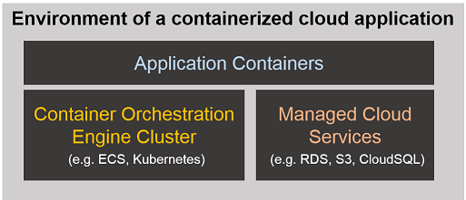

=================
Platform-as-Code
=================

Platform of an application is the run-time environment in which the application runs.
It includes application code/containers, application/web servers, container orchestration engine clusters,
and application’s external resource dependencies such as managed database servers.
Platform-as-Code_ paradigm offers ability to define all such platform elements of a containerized cloud application using declarative configuration files.
These platform definitions can be version controlled and follow software development lifecycle.

.. _Platform-as-Code: https://cloudark.io/resources

CloudARK - Platform-as-Code implementation
-------------------------------------------

CloudARK is a **full-stack microservices development and deployment tool** that is implemented using Platform-as-Code principles.
Currently CloudARK supports Google Cloud and Amazon AWS.

Key elements of CloudARK:

- **Intelligent abstractions**:

  *Environment* is the top level abstraction. It defines container orchestration engine cluster and managed cloud services for the application.
  *Application* is composed of one or more application container/s and is deployed in the environment.
  You get a shell customized for the environment with ability to directly use cloud-native CLIs against the platform elements created in that environment.

- **Declarative platform definition**:

  *environment yaml* file is used to define managed cloud resources within an environment; *application yaml* is used to define application
  container (for single container applications);
  *pod/deployment yaml or ecs's task yaml* is supported for multi-container applications.
  No need for platform inputs using command line parameters.

- **Platform element association**:

  Integrated creation and binding of cloud resources with application containers provides view of the entire application run-time environment with
  appropriate platform elements associations.

- **Environment change history**:

  History of operations that change the state of an environment is maintained for traceability and repeatability.

- **Non-hosted implementation**:

  CloudARK is a non-hosted implementation. There is no centralized server like PaaS implementations. CloudARK can be installed anywhere alongside Docker.
  This architecture enables effective local development with Docker environments setup on the individual workstations or laptops.
  The non-hosted nature also simplifies integration of CloudARK with any DevOps workflow.

Use CloudARK to develop and deploy full-stack microservices on Google GKE and Amazon ECS:

- Common language between developers and Ops to share the platform definition of a containerized cloud application. 

- Full-stack application view for better control. 

- Ultimate dev/prod parity_ between local Docker environment and production cloud environment.

- Non-hosted implementation for simplicity and usability.

.. _parity: https://github.com/cloud-ark/cloudark-samples/blob/master/greetings/README.txt

Read this_ for more details about CloudARK

.. _this: https://cloud-ark.github.io/cloudark/docs/html/html/index.html

CloudARK FAQ_

.. _FAQ: https://cloud-ark.github.io/cloudark/docs/html/html/faq.html

CloudARK Roadmap_

.. _Roadmap: https://cloud-ark.github.io/cloudark/docs/html/html/roadmap.html

Try CloudARK
-------------

Developed and Tested on:

- Ubuntu 14.04, 16.04

- Mac OS (El Capitan 10.11.4)

Requires:

- Docker 1.6 and above

- Python 2.7

CloudARK requires Docker to be installed. If you do not have Docker, you can install it following steps from:

https://docs.docker.com/engine/installation/

On Mac OS, make sure the command shell from which you are installing CloudARK is able to run docker commands
without sudo. You can achieve this by executing following command in the shell once Docker VM is up and running:

eval "$(docker-machine env default)"

Once you have installed Docker follow these steps:

1) Clone this repository

2) Install CloudARK

   $ ./install.sh

3) Do cloud setup

   $ cld setup aws

   $ cld setup gcloud

4) Start CloudARK server

   $ ./start-cloudark.sh

5) Clone the cloudark-samples repository (https://github.com/cloud-ark/cloudark-samples.git)

6) Choose a sample application and follow the steps in the included README

Sample commands
----------------

$ cld --help

usage: cld [--version] [-v | -q] [--log-file LOG_FILE] [-h] [--debug]

CloudARK command-line tool to create and manage cloud environments for
containerized applications.

Commands:

  env create

  env list

  env show

  env exec

  env shell

  env delete

  container create

  container list

  container show

  container delete

  app deploy

  app list

  app show

  app logs

  app delete

  setup aws

  setup gcloud

Wordpress deployment on ECS
---------------------------

1) Environment definition

   .. image:: ./docs/screenshots/wordpress/env-yaml.png

2) Create environment
   
   $ cld env create wpenv environment-rds-ecs.yaml
 
   .. image:: ./docs/screenshots/wordpress/env-create.png
      :scale: 125%

   .. image:: ./docs/screenshots/wordpress/env-show-available.png
      :scale: 125%

3) Create application container

   $ cld container create wordpresscont ecr
 
   .. image:: ./docs/screenshots/wordpress/container-create.png
      :scale: 125%

   .. image:: ./docs/screenshots/wordpress/container-ready.png
      :scale: 125%

4) Deploy application

   $ cld app deploy wordpressapp wpenv app-ecs.yaml

   .. image:: ./docs/screenshots/wordpress/app-yaml.png
      :scale: 125%

   .. image:: ./docs/screenshots/wordpress/app-create.png
      :scale: 125%

5) Check application status

   $ cld app show wordpressapp

   .. image:: ./docs/screenshots/wordpress/app-deployment-done.png
      :scale: 125%

   .. image:: ./docs/screenshots/wordpress/app-logs.png
      :scale: 125%

6) Wordpress deployment complete

   .. image:: ./docs/screenshots/wordpress/wordpress-installed.png
      :scale: 125%

   .. image:: ./docs/screenshots/wordpress/wordpress-blog-page-with-elb.png
      :scale: 125%

7) AWS console

   .. image:: ./docs/screenshots/wordpress/wordpress-rds-instance.png
      :scale: 125%

   .. image:: ./docs/screenshots/wordpress/wordpress-task-definition.png
      :scale: 125%

   .. image:: ./docs/screenshots/wordpress/wordpress-container.png
      :scale: 125%

Details
--------

**How is Platform-as-Code different from Platform-as-a-Service?**

Platform-as-Code is a *non-hosted* implementation of platform functionality.
There is no private / public hosted central server like PaaSes. This approach helps improve dev/prod parity and ability to recreate application environments anywhere.

**How is Platform-as-Code different from Infrastructure-as-Code?**

Infrastructure-as-Code implementation treats every platform element as infrastructure resource.
In contrast, Platform-as-Code offers *application-centric abstractions* that simplify modeling a deployment as per the application architecture.

*Deploying on Google GKE*

  $ cld setup gcloud
    - This will request OAuth authorizations for gcloud sdk and gcloud auth library.
      Follow the prompts and provide the required input.

  $ ./restart-cloudark.sh

*Deploying on Amazon ECS*

  $ cld setup aws
    - This will prompt you to enter AWS access_key_id, secret_access_key, region, output format.
      Follow the prompts and provide the required input.

  $ ./restart-cloudark.sh

Your AWS user will need to have following managed policies in order to do deployments using CloudARK.

- AmazonEC2FullAccess
- AmazonEC2ContainerRegistryFullAccess
- AmazonEC2ContainerServiceFullAccess
- AmazonEC2ContainerServiceAutoscaleRole
- AmazonEC2ContainerServiceforEC2Role
- AmazonRDSFullAccess (if your application depends on RDS)

Additionally your AWS user will need to have the EC2 Container Service Role. Use these steps to create it:

-> AWS Web Console -> IAM -> Roles -> Create Role -> Select EC2 Container Service -> In "Select your use case" choose EC2 Container Service
-> Next: Permissions -> Next: Review -> For role name give "EcsServiceRole" -> Hit "Create Role".

Finally you will also need to add IAM policy shown below which will grant permissions to the
ECS agent running on your ECS cluster instances to perform IAM actions
such as creating a ECS instance profile role and assuming that role.
This is required for the ECS agent to communicate with the ECS service.
Use these steps to create this policy:

-> AWS Web Console -> IAM -> Select your user in IAM -> Add permissions -> Attach existing policies directly -> Create Policy
-> Create Your Own Policy

In the Policy Document enter following policy. Replace <account-id> with your account id.

::

  {
      "Version": "2012-10-17",
      "Statement": [
          {
              "Effect": "Allow",
              "Action": "iam:*",
              "Resource": ["arn:aws:iam::<account-id>:role/*",
                           "arn:aws:iam::<account-id>:instance-profile/*]"
          }
      ]
  }

Once the policy is created attach it to your user.

Contact:
--------

Devdatta Kulkarni: devdatta at cloudark dot io
